# Notification Library

Librería de notificaciones extensible, agnóstica a frameworks y construida con Java 21. Unifica el envío simulado por Email, SMS y Push, manteniendo separados los conceptos de canal y proveedor. El repositorio también incluye una API Spring Boot demostrativa, sin introducir dependencias de Spring dentro de la librería.

## Estado funcional

- Java 21 y Gradle 8.13.
- Arquitectura hexagonal y principios SOLID.
- Email: SendGrid y Mailgun simulados.
- SMS: Twilio simulado.
- Push: Firebase Cloud Messaging simulado.
- Envío síncrono y asíncrono con `CompletableFuture`.
- Configuración 100 % mediante objetos Java en la librería.
- API REST con Spring Boot, Spring Security, Bean Validation y OpenAPI.
- Records, sealed interfaces, Value Objects, Lombok y MapStruct.
- JUnit 5, Mockito, AssertJ y JaCoCo.
- Docker y GitHub Actions como complementos operativos.

## Arquitectura

```mermaid
flowchart LR
    Client[Java puro o API REST] --> Facade[NotificationFacade]
    Facade --> Input[SendNotificationInputPort]
    Input --> UseCase[SendNotificationUseCase]
    UseCase --> Output[NotificationProviderPort]
    Output --> Strategy[Strategy por canal]
    Strategy --> Adapter[Adapter de proveedor]
    Adapter --> Result[NotificationResult]
```



Dependencias entre capas:

```text
notification-demo-api  ───────▶ notification-library

Domain        ◀── Application ◀── Infrastructure
  ▲                    ▲
  └──── no depende de frameworks, HTTP, Spring o configuración externa
```

### Módulos

```text
notification-parent/
├── notification-library/     # Dominio, puertos, casos de uso y adaptadores
├── notification-demo-api/    # Adaptador REST Spring Boot
├── examples/                 # Ejemplos de consumo, fuera del source set
├── .github/workflows/        # Integración continua y publicación
├── Dockerfile
└── docker-compose.yml
```

## Decisiones principales

### Librería y API separadas

El núcleo no utiliza `@Component`, `@Service`, `@Configuration`, YAML ni properties. Spring Boot solo existe en `notification-demo-api`, que actúa como consumidor y adaptador de entrada.

### Gradle en lugar de Maven

El reto se implementa con Gradle porque es la herramienta dominada por el desarrollador y facilita el proyecto multi-módulo. La librería conserva publicación compatible con repositorios Maven mediante `maven-publish`.

### Sin conexiones HTTP reales

Los proveedores simulan la aceptación del mensaje. Sus configuraciones modelan datos realistas —credenciales, endpoint, remitente, proyecto o cuenta— sin introducir clientes HTTP ni dependencias externas innecesarias.

## Requisitos

- JDK 21.
- Gradle Wrapper 8.13 incluido en el repositorio de trabajo.
- IntelliJ IDEA recomendado.
- Docker 24+ para ejecutar el contenedor.

En IntelliJ activa:

```text
Settings → Build, Execution, Deployment → Compiler → Annotation Processors
→ Enable annotation processing
```

## Compilar y probar

Windows:

```powershell
.\gradlew.bat clean check --no-configuration-cache
```

Linux/macOS:

```bash
./gradlew clean check --no-configuration-cache
```

Reportes principales:

```text
notification-library/build/reports/tests/test/index.html
notification-library/build/reports/jacoco/test/html/index.html
notification-demo-api/build/reports/tests/test/index.html
notification-demo-api/build/reports/jacoco/test/html/index.html
```

La tarea `check` exige al menos 80 % de cobertura de líneas en `notification-library`.

## Configuración mediante Java puro

Este es el punto de composición para una aplicación Java sin Spring:

```java
EmailConfiguration email = EmailConfiguration.builder()
        .provider(EmailConfiguration.Provider.SENDGRID)
        .apiKey(System.getenv("SENDGRID_API_KEY"))
        .sender(new EmailAddress("sender@example.com"))
        .build();

SmsConfiguration sms = SmsConfiguration.builder()
        .provider(SmsConfiguration.Provider.TWILIO)
        .accountSid(System.getenv("TWILIO_ACCOUNT_SID"))
        .authToken(System.getenv("TWILIO_AUTH_TOKEN"))
        .fromNumber(new PhoneNumber("+50370000000"))
        .build();

PushConfiguration push = PushConfiguration.builder()
        .provider(PushConfiguration.Provider.FIREBASE)
        .projectId("notification-project")
        .credentials(System.getenv("FIREBASE_CREDENTIALS"))
        .build();

NotificationConfiguration configuration = NotificationConfiguration.builder()
        .email(email)
        .sms(sms)
        .push(push)
        .build();

List<NotificationProviderPort> providers =
        NotificationProviderFactory.create(configuration);

NotificationFacade facade = NotificationFacade.create(providers);
```

Enviar un correo:

```java
EmailNotification notification = EmailNotification.create(
        new EmailAddress("customer@example.com"),
        new Subject("Welcome"),
        new MessageBody("Your account has been created")
);

NotificationResult result = facade.send(notification);
```

Envío asíncrono:

```java
CompletableFuture<NotificationResult> result =
        facade.sendAsync(notification);
```

El ejemplo completo está en `examples/java-pure/NotificationExamples.java`.

## Integración desde Spring Boot

La API demo configura la librería con beans creados por código:

```java
@Configuration(proxyBeanMethods = false)
class NotificationLibraryConfiguration {

    @Bean
    NotificationConfiguration notificationConfiguration(Environment environment) {
        EmailConfiguration email = EmailConfiguration.builder()
                .provider(EmailConfiguration.Provider.SENDGRID)
                .apiKey(environment.getRequiredProperty("NOTIFICATION_EMAIL_API_KEY"))
                .sender(new EmailAddress("sender@example.com"))
                .build();

        return NotificationConfiguration.builder()
                .email(email)
                .build();
    }

    @Bean
    NotificationFacade notificationFacade(NotificationConfiguration configuration) {
        return NotificationFacade.create(
                NotificationProviderFactory.create(configuration)
        );
    }
}
```

La implementación real está en:

```text
notification-demo-api/src/main/java/com/challenge/notifications/demo/config/
NotificationLibraryConfiguration.java
```

Las anotaciones de Spring permanecen fuera de `notification-library`.

## Variables de entorno de la API Demo

| Variable | Predeterminado local | Uso |
|---|---|---|
| `DEMO_API_USERNAME` | `notification-user` | Usuario HTTP Basic |
| `DEMO_API_PASSWORD` | `change-me-local-only` | Contraseña HTTP Basic |
| `NOTIFICATION_EMAIL_PROVIDER` | `SENDGRID` | `SENDGRID` o `MAILGUN` |
| `NOTIFICATION_EMAIL_API_KEY` | valor demo | Credencial simulada de Email |
| `NOTIFICATION_EMAIL_SENDER` | `sender@example.com` | Remitente |
| `NOTIFICATION_SMS_ACCOUNT_SID` | valor demo | Cuenta Twilio simulada |
| `NOTIFICATION_SMS_AUTH_TOKEN` | valor demo | Token Twilio simulado |
| `NOTIFICATION_SMS_FROM_NUMBER` | `+50370000000` | Número E.164 de origen |
| `NOTIFICATION_PUSH_PROJECT_ID` | `notification-demo` | Proyecto Firebase simulado |
| `NOTIFICATION_PUSH_CREDENTIALS` | valor demo | Credenciales Firebase simuladas |
| `PORT` | `8080` | Puerto HTTP de la API |

Los valores predeterminados solo facilitan la demostración local.

## Ejecutar la API

PowerShell:

```powershell
$env:DEMO_API_USERNAME="notification-user"
$env:DEMO_API_PASSWORD="change-me-local-only"
.\gradlew.bat :notification-demo-api:bootRun
```

Endpoints públicos de documentación y salud:

```text
http://localhost:8080/swagger-ui/index.html
http://localhost:8080/v3/api-docs
http://localhost:8080/actuator/health
```

## API REST

| Método | Ruta | Autenticación | Resultado |
|---|---|---|---|
| `POST` | `/api/v1/notifications` | HTTP Basic | `200 OK` |
| `POST` | `/api/v1/notifications/async` | HTTP Basic | `202 Accepted` |
| `GET` | `/v3/api-docs` | Pública | OpenAPI JSON |
| `GET` | `/swagger-ui/index.html` | Pública | Swagger UI |
| `GET` | `/actuator/health` | Pública | Estado de salud |

### Email

```bash
curl --user "notification-user:change-me-local-only" \
  --request POST "http://localhost:8080/api/v1/notifications" \
  --header "Content-Type: application/json" \
  --data '{
    "channel": "EMAIL",
    "recipient": "customer@example.com",
    "subject": "Welcome",
    "message": "Your account has been created"
  }'
```

### SMS

```bash
curl --user "notification-user:change-me-local-only" \
  --request POST "http://localhost:8080/api/v1/notifications" \
  --header "Content-Type: application/json" \
  --data '{
    "channel": "SMS",
    "recipient": "+50370000000",
    "message": "Your security code is 1234"
  }'
```

### Push asíncrono

```bash
curl --user "notification-user:change-me-local-only" \
  --request POST "http://localhost:8080/api/v1/notifications/async" \
  --header "Content-Type: application/json" \
  --data '{
    "channel": "PUSH",
    "recipient": "device-token-1234567890",
    "message": "You have a new message"
  }'
```

### Error de validación

```bash
curl --user "notification-user:change-me-local-only" \
  --request POST "http://localhost:8080/api/v1/notifications" \
  --header "Content-Type: application/json" \
  --data '{
    "channel": "SMS",
    "recipient": "70000000",
    "subject": "Not supported",
    "message": "Message"
  }'
```

## Manejo de errores

| Excepción | HTTP | Ejemplo de código |
|---|---:|---|
| `ValidationException` | 400 | `INVALID_EMAIL` |
| JSON inválido | 400 | `MALFORMED_REQUEST` |
| Bean Validation | 400 | `REQUEST_VALIDATION_ERROR` |
| Sin autenticación | 401 | respuesta de Spring Security |
| `ProviderException` | 502 | `PROVIDER_ERROR` |
| `ConfigurationException` | 500 | `CONFIGURATION_ERROR` |
| Error inesperado | 500 | `INTERNAL_ERROR` |

Las respuestas inesperadas ocultan detalles internos y no exponen credenciales.

## Patrones y SOLID

- **Strategy:** una estrategia por canal valida el subtipo antes de delegar.
- **Factory:** `NotificationProviderFactory` crea adaptadores según la configuración.
- **Builder:** configuración legible e inmutable por canal.
- **Facade:** `NotificationFacade` simplifica el uso público.
- **Adapter:** SendGrid, Mailgun, Twilio y Firebase implementan el puerto de salida.
- **Result:** `NotificationResult` representa éxito o fallo sin respuestas ambiguas.
- **SRP:** dominio, orquestación, configuración, proveedores y REST están separados.
- **OCP:** se agregan proveedores implementando el puerto y extendiendo la factory.
- **LSP:** cualquier adaptador válido sustituye a `NotificationProviderPort`.
- **ISP:** los contratos son pequeños y específicos.
- **DIP:** los casos de uso dependen de puertos, no de proveedores concretos.

## Java 21, programación funcional y concurrencia

- Records para modelos, Value Objects y DTOs.
- Sealed interface para la jerarquía de notificaciones.
- Pattern matching y `switch` exhaustivo.
- Streams y `Collectors.toUnmodifiableMap` para registrar proveedores.
- `Optional` en configuración y resultados.
- `CompletableFuture` para envío no bloqueante.
- Executor inyectable; la API demo usa virtual threads y administra su ciclo de vida.

## Pruebas

La solución contiene pruebas para:

- Value Objects e invariantes de dominio.
- Email, SMS y Push.
- Resultados exitosos y fallidos.
- Puertos y casos de uso con Mockito.
- Detección de proveedores duplicados o inválidos.
- Factory, Strategy y Builders.
- Adaptadores simulados.
- Mapper MapStruct.
- Controller con `MockMvc`.
- Autenticación y autorización.
- Manejo global de errores.
- Flujo de integración completo de la API.

Comando para un test específico:

```powershell
.\gradlew.bat :notification-library:test `
  --tests "com.challenge.notifications.application.usecase.SendNotificationUseCaseTest"
```

## Publicar y consumir la librería

Publicación local:

```powershell
.\gradlew.bat :notification-library:publishToMavenLocal
```

Consumo desde Gradle:

```groovy
repositories {
    mavenLocal()
}

dependencies {
    implementation 'com.challenge.notifications:notification-library:1.0.0'
}
```

Consumo desde Maven:

```xml
<dependency>
    <groupId>com.challenge.notifications</groupId>
    <artifactId>notification-library</artifactId>
    <version>1.0.0</version>
</dependency>
```

Publicación en GitHub Packages, Artifactory, Azure Artifacts o un repositorio Maven compatible:

```powershell
$env:MAVEN_REPOSITORY_URL="https://repository.example.com/releases"
$env:MAVEN_REPOSITORY_USERNAME="user"
$env:MAVEN_REPOSITORY_PASSWORD="token"
.\gradlew.bat :notification-library:publish
```

Las credenciales nunca deben incorporarse al repositorio.

## Docker

Construir:

```bash
docker build -t notification-demo-api:1.0.0 .
```

Ejecutar:

```bash
docker run --rm -p 8080:8080 \
  -e DEMO_API_USERNAME=notification-user \
  -e DEMO_API_PASSWORD=change-me-local-only \
  notification-demo-api:1.0.0
```

Con Compose:

```bash
docker compose up --build
```

El Dockerfile utiliza build multi-stage, Java 21, Gradle 8.13, usuario no root y healthcheck.

## CI/CD y DevOps

### Integración continua

`.github/workflows/ci.yml` ejecuta en pull requests y pushes:

```text
checkout → Java 21 → validación del Wrapper → clean check → artefactos
```

### Entrega continua

`.github/workflows/release.yml` publica la librería cuando se crea un tag `vX.Y.Z`. El artefacto queda disponible sin desplegar automáticamente la API.

### Despliegue continuo

No se automatiza un despliegue a una nube específica porque el reto no define un proveedor cloud ni solicita una plataforma de ejecución. El artefacto Docker queda listo para ser promovido por el entorno que el equipo determine.

Diferencias:

- **Integración continua:** integrar cambios con compilación y pruebas frecuentes.
- **Entrega continua:** mantener el artefacto listo para producción, con publicación controlada.
- **Despliegue continuo:** promover automáticamente cada cambio validado a producción.

Bitbucket Pipelines y GitLab CI pueden implementar un flujo equivalente ejecutando el mismo comando canónico: `gradle clean check` o `./gradlew clean check`.

## Seguridad

- Secretos por variables de entorno o un gestor de secretos administrado por la plataforma elegida.
- Credenciales excluidas de `toString()` en las configuraciones.
- Tokens, teléfonos y destinatarios se enmascaran en logs cuando corresponde.
- HTTP Basic es deliberadamente simple y solo demuestra Spring Security.
- En producción puede reemplazarse por OAuth2/JWT o el mecanismo de identidad de la plataforma elegida.
- Contenedor con usuario no root.
- Respuestas 500 sanitizadas.
- No registrar API keys, tokens ni credenciales completas.

## Bases de datos y Spring Data

No se añade persistencia porque el alcance es una librería de entrega simulada. Agregar Oracle, SQL Server, MySQL o Spring Data sin una necesidad funcional introduciría acoplamiento y complejidad artificiales.

Una evolución puede definir el puerto:

```java
public interface NotificationHistoryPort {
    void save(NotificationResult result);
}
```

Después se pueden crear adaptadores JPA independientes para Oracle, SQL Server o MySQL sin modificar el dominio ni el caso de uso principal.

## Extensibilidad

### Agregar un proveedor de Email

1. Implementar `NotificationProviderPort`.
2. Validar que el canal sea `EMAIL`.
3. Agregar la opción al enum de configuración.
4. Registrar el adaptador en `NotificationProviderFactory`.
5. Añadir pruebas de configuración, adapter y factory.

### Agregar un canal nuevo

1. Agregar el valor de `NotificationChannel`.
2. Crear el Record de dominio y actualizar la sealed interface.
3. Crear configuración, Strategy y Provider Port adapter.
4. Extender la factory y el mapper REST.
5. Añadir pruebas unitarias e integración.

## Producción

Flujo recomendado:

```text
feature branch
→ pull request
→ clean check
→ revisión técnica
→ merge a main
→ imagen inmutable
→ staging
→ smoke tests
→ aprobación
→ despliegue controlado
→ monitoreo
```

Cada imagen debe identificarse por commit SHA o versión, nunca solo por `latest`. La plataforma de destino debe conservar una versión estable para permitir rollback y promoción controlada.

## Metodologías ágiles

El desarrollo se organizó en entregas verticales: dominio, aplicación, infraestructura, API y operaciones. En Scrum pueden representarse como historias dentro de un sprint; en Kanban, como flujo con límites de trabajo en curso y criterios de terminado basados en pruebas, cobertura y documentación.

## Limitaciones y roadmap

- Los proveedores no realizan llamadas HTTP reales.
- No existe persistencia de historial.
- No hay reintentos, circuit breaker ni rate limiting.
- La API demo usa HTTP Basic en memoria.
- El envío masivo y templates quedan como evolución.
- Para producción real se recomienda observabilidad distribuida, métricas de negocio, OAuth2/JWT y políticas de retry específicas por proveedor.
